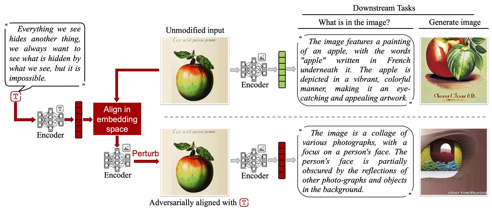

<h1 align="center"> 
Adversarial Illusions in Multi-Modal Embeddings </h1>

<p align="center"> <i>Tingwei Zhang*, Rishi Jha*, Eugene Bagdasaryan, and Vitaly Shmatikov</i></p>

Multi-modal embeddings encode texts, images, sounds, videos, etc., into a single embedding space, aligning representations across different modalities (e.g., associate an image of a dog with a barking sound). In this paper, we show that multi-modal embeddings can be vulnerable to an attack we call "adversarial illusions." Given an image or a sound, an adversary can perturb it to make its embedding close to an arbitrary, adversary-chosen input in another modality.

These attacks are cross-modal and targeted: the adversary is free to align any image and any sound with any target of his choice. Adversarial illusions exploit proximity in the embedding space and are thus agnostic to downstream tasks and modalities, enabling a wholesale compromise of current and future downstream tasks and modalities not available to the adversary. Using ImageBind and AudioCLIP embeddings, we demonstrate how adversarially aligned inputs, generated without knowledge of specific downstream tasks, mislead image generation, text generation, zero-shot classification, and audio retrieval.

We investigate transferability of illusions across different embeddings and develop a black-box version of our method that we use to demonstrate the first adversarial alignment attack on Amazon's commercial, proprietary Titan embedding. Finally, we analyze countermeasures and evasion attacks.

Paper link:
[https://arxiv.org/abs/2308.11804](https://arxiv.org/abs/2308.11804)



Most experiments run on a single NVIDIA 2080ti GPU.

# Installation
1. **Setup Environment:** run `conda env create -f environment.yml`.
2. **Download Data:** We run experiments on ImageNet [1], AudioSet [2], and LLVIP [3]. For ease of reproduction, we provide necessary config files for all datasets and 100-example subsets of the latter two datasets as a [release](https://github.com/rjha18/adversarial_illusions/releases). To install, please download the `data.zip` file and, from root, run `unzip /path/to/data.zip -d .`.
    - For imagenet, we only use the validation set. As required by PyTorch, we also require `ILSVRC2012_devkit_t12.tar.gz` and `ILSVRC2012_img_val.tar` to be located in `data/imagenet/`. Please follow the instructions in [the note on PyTorch's page](https://pytorch.org/vision/main/generated/torchvision.datasets.ImageNet.html) to acquire those two files.
3. **AudioCLIP Checkpoints:** To conduct any experiments on AudioCLIP, we require pretraining checkpoints.
    - For the full checkpoint, run:
      ```
      wget https://github.com/AndreyGuzhov/AudioCLIP/releases/download/v0.1/AudioCLIP-Full-Training.pt -P bpe/
      ```
    - For the partial checkpoint (used for transfer attacks):
      ```
      wget https://github.com/AndreyGuzhov/AudioCLIP/releases/download/v0.1/AudioCLIP-Partial-Training.pt -P bpe/
      ```
4. **Submodule Setup:** This includes lightly adapted code from [ImageBind](https://github.com/facebookresearch/ImageBind), [AudioCLIP](https://github.com/AndreyGuzhov/AudioCLIP), and [DiffJPEG](https://github.com/mlomnitz/DiffJPEG/) and directly employs two submodules: [PandaGPT](https://github.com/yxuansu/PandaGPT) and [BindDiffusion](https://github.com/sail-sg/BindDiffusion). To initialize the two submodules (if desired), run the following and download the checkpoints as described below:
    ```
    git submodule update --init
    scp image_text_generation/image_generation.py BindDiffusion
    scp image_text_generation/text_generation_demo.ipynb PandaGPT/code
    scp image_text_generation/text_generation.py PandaGPT/code
    ```
    - **PandaGPT Checkpoints:** To conduct any experiments with PandaGPT, place the [PandaGPT checkpoints](https://github.com/yxuansu/PandaGPT#2-running-pandagpt-demo-back-to-top) into `PandaGPT/pretrained_ckpt` by following [these instructions](PandaGPT/pretrained_ckpt/README.md).
    - **BindDiffusion Checkpoints:** To conduct any experiments with BindDiffusion, place the [BindDiffusion checkpoints](https://github.com/sail-sg/BindDiffusion) into `BindDiffusion/checkpoints` by following [these instructions](BindDiffusion/README.md).


# Image Illusion Demo on Text Generation
1. Run the `image_illusion_demo.ipynb` notebook.
2. Replace the existing image and aligned text with your own choices to generate an image illusion.
3. Run `text_generation_demo.ipynb` to see a quick demonstration of image illusions comprising text generation task.

# Experiments

## White Box
Our white box experiments (save for thermal and baseline experiments) are run using the `adversarial_illusions.py` script and configured by a `{EXPERIMENT_NAME}.toml` file in the `configs/` folder. An explanation of each of the hyperparameters can be found here: `configs/explanations/illusions.toml`. Some examples are provided in the rest of the `configs/` folder:

- **Image Classification:** 
  - `python adversarial_illusions.py imagenet/whitebox/{MODEL_NAME}.toml`
- **Audio Classification:**
  - `python adversarial_illusions.py audiocaps/whitebox/{MODEL_NAME}.toml`
- **Audio Retrieval:**
  - `python adversarial_illusions.py audioset/whitebox/{MODEL_NAME}.toml`
- **Thermal Image Classification:**
  - `python thermal_illusion_classification.py > outputs/thermal/result.txt` 

Our baseline numbers are run using the `evaluate_illusions.py` file and configured in the `configs/baseline/` directory. The `.toml` files have a slightly different structure, and descriptions can be found here: `configs/explanations/baseline.toml`. The two white-box baselines as described in the paper can be run as follows:
  - `python evaluate_illusions.py baseline/organic/{TASK_NAME}.toml`
  - `python evaluate_illusions.py baseline/adversarial/{TASK_NAME}.toml`

## Black Box
  - **Run Transfer Attack Experiments:** Our transfer numbers are produced similarly to our baselines, but require an additional flag `adv_file`. This parameter should point to a `.npy` file containing the adversarial images to evaluate. See `configs/explanations/transfer.toml` for a description. An example:
    - `python adversarial_illusions.py imagenet/transfer/ensemble.toml`
    - `python evaluate_illusions.py imagenet/transfer/ensemble_eval.toml`

  - **Run Query-based Attack Experiments:**
     - `python query_attack.py imagebind`
     - `python query_attack.py audioclip`

  <!-- - **Run Hybrid Attack Experiments:**
     - `python query_attack.py imagenet/hybrid/imagebind`
     - `python query_attack.py imagenet/hybrid/audioclip` -->

## Defense
  - **Certification:** `certification.ipynb`
  - **Feature Distillation:** 
  
    ```
    python adversarial_illusions.py imagenet/whitebox/imagebind
    python adversarial_illusions.py imagenet/whitebox/audioclip
    python adversarial_illusions.py imagenet/whitebox/imagebind_jpeg
    python adversarial_illusions.py imagenet/whitebox/audioclip_jpeg
    python evaluate_jpeg.py
    ```
  - **Anomaly Detection:** `python anomaly_detection.py`


Please feel free to email: [tz362@cornell.edu](mailto:tz362@cornell.edu) or raise an issue.


